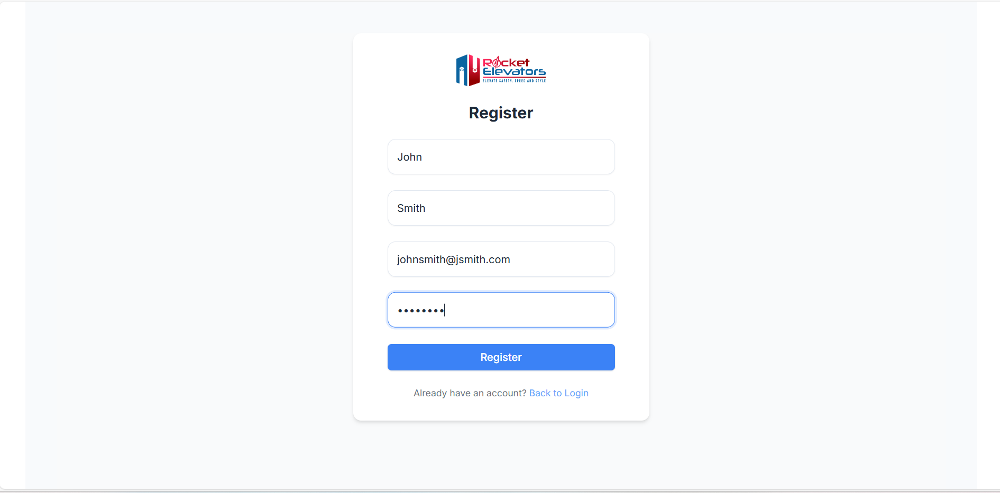
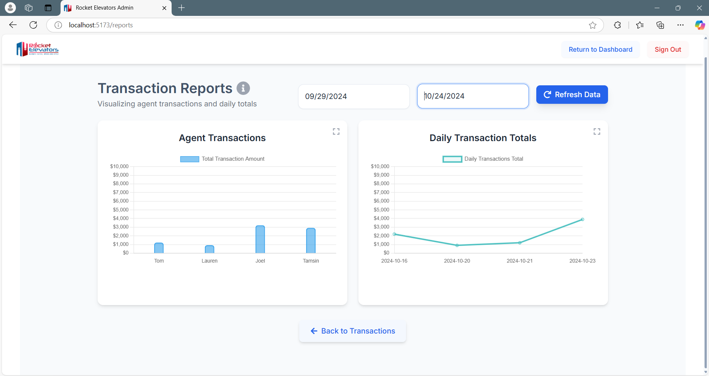

# Rocket Elevators Admin Portal

A modern, responsive web application built with React and Node.js that provides an admin portal for Rocket Elevators. This application allows users to manage & track agents as well as transactions, and visualize business data through interactive reports.

## Features

### 🔐 Authentication System
- Secure login and registration system
- JWT-based authentication
- Session management with cookies
- Form validation and error handling


*Login page with form validation and error handling*


*Registration page with real-time validation*

### 👥 Agent Management
- View all agents in a sortable, filterable table
- Add new agents
- Edit existing agent details
- Delete agents with confirmation
- Search agents by name
- Filter agents by region
- Toggle between paginated and scrollable views


*Agent list with sorting, filtering, and search capabilities*


*Agent creation/editing form*

### 💰 Transaction Management
- Create new transactions
- Edit existing transactions
- View transaction history
- Search transactions by agent name
- Sort transactions by various fields
- Responsive table layout
- Toggle between list and scroll view


*Transaction list with search and sort functionality*


*Transaction creation/editing form*

### 📊 Reports and Analytics
- Interactive charts using Chart.js
- Bar chart showing agent transaction totals
- Line chart displaying daily transaction trends
- Date range filtering for report data
- Expandable charts in lightbox view
- Summary statistics
- Real-time data updates


*Reports dashboard with interactive charts*


*Reports with date range filtering*


*Expanded chart view in lightbox*

## Technology Stack

### Frontend
- **React** - UI library
- **React Router** - Navigation
- **Chart.js** - Data visualization
- **Tailwind CSS** - Styling
- **Axios** - HTTP client
- **React Icons** - Icon components
- **React DatePicker** - Date selection

### Backend
- **Node.js** - Runtime environment
- **Express** - Web framework
- **MongoDB** - Database
- **Mongoose** - ODM
- **JWT** - Authentication
- **Bcrypt** - Password hashing
- **CORS** - Cross-origin resource sharing

## Installation

```bash
# Clone the repository
git clone git@github.com:Gamikaru/rocket-elevators-fullstack-admin-app-m78.git

# Install dependencies for client
cd client
npm install

# Install dependencies for server
cd ../server
npm install

# Run the development server
npm run dev

# Run the client
cd ../client
npm run dev
```

### Environment Setup
Create a `.env` file in the server directory:

```
PORT=3004
MONGODB_URI=your_mongodb_connection_string
JWT_SECRET=your_jwt_secret
```

## Features in Detail

### Authentication System
- Secure password hashing
- JWT token generation and validation
- Protected routes
- Session persistence
- Form validation

### Agent Management
- CRUD operations
- Real-time search
- Dynamic filtering
- Responsive table
- Sorting by columns
- Pagination controls

### Transaction Management
- Create/Edit/View transactions
- Associate transactions with agents
- Date selection
- Amount validation
- Search functionality

### Reports and Analytics
- Interactive data visualization
- Date range filtering
- Summary statistics
- Expandable charts
- Real-time updates
